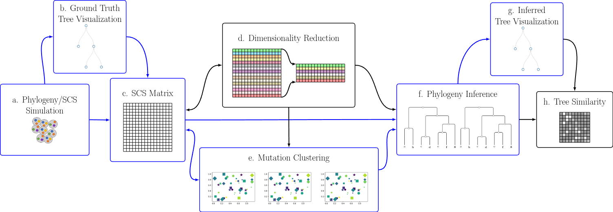

# PHYLO-PIPELINE

A pipeline for the following toolchain developed by AlgoLabs:  
- [celluloid](https://github.com/AlgoLab/celluloid)  
    A tool designed to cluster single-cell-sequencing datasets that employs K-modes clustering and a novel similarity measure to better work around the uncertain data points that are frequently produced with such sequencing techniques.
- [sasc](https://github.com/sciccolella/sasc)  
    A tool designed to infer phylogenies from inaccurate genotype datasets obtained using SCS techniques, that employs simulated annealing to explore the solution spaces in the k-dollo model, that better accounts for the peculiarities of cancer cell evolution without being constrainted by the infinite sites assumption.
- [mp3](https://github.com/AlgoLab/mp3treesim)  
    A tool for comparisons between (potentially) fully labeled phylogenies with poly-occurring labels, with a similarity measure based on the comparison of the minimum topologies for each label triplet found in the two trees.

In the tumor phylogeny pipeline depicted below (from https://doi.org/10.1007/978-3-031-82768-6_8), celluloid would perform step e. Mutation Clustering, sasc would perform step f. Phylogeny Inference, and mp3 would perform step h. Tree Similarity.



### INSTALLATION

Note: in order to install this package, a [graphviz-dev](https://pygraphviz.github.io/documentation/stable/install.html) installation is required.
```graphviz-dev``` is required to build the tool, while ```graphviz``` is required to
call ```PhylogenyTree.draw_to_file()``` and its overrides.

Once the required external software has been installed, run:
```
git clone git@github.com:plastic-phy/plastic.git --recurse-submodules
cd phylo-pipeline
pip install .
```
The tool will be installed under the name ```phylopipeline```.

### USAGE

This package exposes one module, ```phylo``` and three public submodules:
```
phylo.mp3
phylo.sasc
phylo.celluloid
```
That can be imported with the usual python import directives like:
```
from phylo import sasc as sc
from phylo.celluloid import cluster_mutations
```

The three modules have been designed with the intent to closely mirror the behaviour of the three original tools while exposing them as library modules. Reading the original documentations of the tools and the documentation of the modules, which is 
reachable with the likes of:
```
from phylo import sasc
help(sasc)
```
will be enough to understand the usage of the modules.

Along with their main functions, the modules expose structures that are designed to easily load, store, visualize and modify the relevant datasets. Whenever structures of this kind are exposed in a module, its documentation makes mention of them, and the structures have their own documentation accessible as usual through ```help()```.

